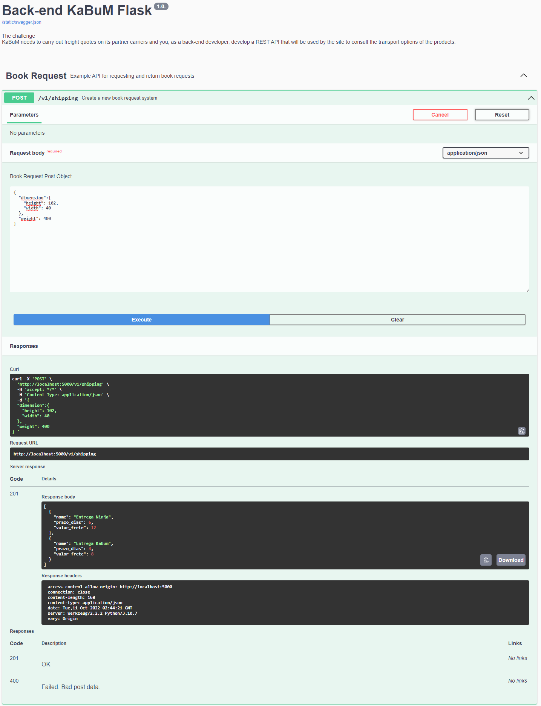

<h1 align="center">🐱‍👤Desafio Back-end KaBuM!⚡</h1>
<div align="center">
    Desafio Back-end, Python, Flask.
</div>
<div align="center">

  
</div>

<h2> Descrição do Projeto </h2>

O KaBuM necessita realizar cotações de fretes em suas transportadoras parceiras e você, como desenvolvedor back-end, deve desenvolver uma API REST que será utilizada pelo site para a consulta de opções de transportes dos produtos.

<div>
    <h2> Requisites </h2>
    <a target="_blank" href="https://www.python.org/downloads/">📌- Python  <br></a>
    <a target="_blank" href="https://flask-restplus.readthedocs.io/en/stable/">📌- Flask   <br></a>
    <a>📌- Pip - Dependency Management.   <br></a>
</div>

<div>
    <h2>Virtual Environments (Windows)</h2>
    <a target="_blank" href="https://www.python.org/downloads/windows/">Install Python<br></a>
</div>

```
pip install virtualenv
py -3 -m venv venv
.\venv\Scripts\Activate.ps1
```

<div>
    <h2>Virtual Environments 🐧(Linux)</h2>
    <a target="_blank" href="https://www.python.org/downloads/">Install Python<br></a>
</div>

```
$ sudo apt-get install python-virtualenv
$ python3 -m venv venv
$ .venv/bin/activate
```

<div>
    <h2>Virtual Environments (Docker)</h2>
    <a target="_blank" href="https://www.docker.com/">Install Docker<br></a>
</div>

```
docker image build -t app-backend-kabum .
docker run -p 5000:5000 -d app-backend-kabum
```

<div>
    <h2>Install Project Dependencies</h2>

```
pip install -r requirements.txt
```

</div>

<div>
    <h2>Runing Project</h2>

```
python app.py
``` 

</div>

<div>
    <h2>Routes healthcheck GET and shipping POST</h2>

```
http://localhost:5000/v1/
http://localhost:5000/v1/shipping/
```
</div>

<div>
    <h2>Documentation Test POST</h2>
    
</div>

<div>
    <h2>For Tests</h2>

<div>
    <h2> Requisites </h2>
    <a target="_blank" href="https://docs.pytest.org/en/7.1.x/getting-started.html">📌- Pytest  <br></a>
    <a target="_blank" href="https://www.python-httpx.org/quickstart/">📌- httpx   <br></a>
</div>

<div>
    <h2>Run Tests</h2>

```
pytest . -v
``` 

</div>

<div>
  <h5>Wiliender Ferreira Silva</h5>
</div>
